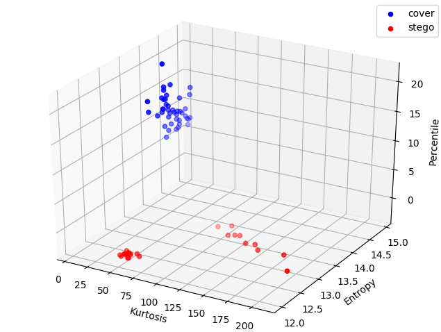

#**Video stenanalysis using collusion attack, PTIT 2018**
##1. Nghiên cứu vầ thuật toán phát hiện
    - Dựa trên 1 bài báo của UDIT BUDHIA, ["STEGANALYSIS OF VIDEO SEQUENCES USING COLLUSION SENSITIVITY", May 2005](docs/video_steganalysis.pdf)
    - Bài nghiên cứu và báo cáo [Báo cáo về giấu tin trong video và phương pháp giấu tin trong video sử dụng collusion attack](docs/video_steganalysis_research_PTIT.docx)
##2. Cấu trúc của project
**Input của thuật toán:**
    - Tập các frames của các video ở mức grayscale(màu 8-bit) đã được giấu tin và chưa được giấu 

| Thư mục/files        | Nội dung           | Chi tiết  |
| ------------- |:-------------:| -----:|
|   docs/        |Chứa các tài liệu và nghiên cứu về thuật toán|
| images/      | Chứa các video frames |images\cover: Chứa các video frames của 1 video mà không có giấu tin images\stego: Chứa các video để giấu tin vào images/collude: Chứa các video sau khi thực hiện collusion attack 
| feature.csv    | File chứa các đặc trưng được extract ra từ các video frame    |    |
| main.csv | Application, nơi chạy thuật toán       |     |
| collusion_attack.py| Thuật toán collusion attack | |
|dct_stego.py| Thuật toán DCT giấu tin vào frame|
|feature_extract.py| Trích xuất thuộc tính|
|train_and_test| Thuật toán ML để trainning và test| 
##3. Pre-installation
- pip install setuptools
- python setup.py
##4. Sử dụng và kết quả
- Copy các video frames vào images/stego images/cover, các frames trong cùng 1 video nằm trong 1 thư mục
- Chạy main.py sẽ thực hiện các công việc: 
    1. Giấu tin vào frames trong images/stego
    2. Thực hiện collusion attack 
    3. Thực hiện extract feature
    4. Thực hiện trainning và test
- Kết quả:
    1. docs/result.txt
    2. 
    